# 🏗️ Awesome Construction Estimating & Quantity Takeoff

<div align="center">



<p align="center">
  <a href="https://github.com/ishandutta2007/Awesome-Awesome-Awesome"></a>
  <a href="https://discord.gg/jc4xtF58Ve"></a>
  <a href="https://github.com/ishandutta2007/Awesome-Construction-Estimating/stargazers"></a>
  <a href="https://github.com/ishandutta2007/Awesome-Construction-Estimating/network/members"></a>
  <a href="https://github.com/ishandutta2007/Awesome-Construction-Estimating/blob/main/LICENSE"></a>
  <a href="https://github.com/ishandutta2007/Awesome-Construction-Estimating/issues"></a>
  <a href="https://github.com/ishandutta2007/Awesome-Construction-Estimating/blob/main/README.md#how-to-contribute"></a>
  <a href="https://github.com/ishandutta2007"></a>
</p>

**A curated index of commercial SaaS platforms, open-source repositories, 5D BIM toolkits, AI quantity takeoff engines, and preconstruction cost intelligence frameworks.**

*Last updated: August 2026*

</div>

---

## 📖 Overview

Construction cost estimating and digital quantity takeoff (QTO) form the backbone of capital project profitability, risk control, and preconstruction planning. This repository is an authoritative directory tracking both **Commercial SaaS / Hosted Platforms** and **Open-Source Software & Toolkits** used by general contractors, specialty subcontractors, cost engineers, estimators, and quantity surveyors worldwide.

Whether you are seeking full-featured commercial estimating platforms, building custom automated takeoff pipelines with Python and Computer Vision, extracting 5D BIM quantities from open IFC models, or orchestrating multi-agent AI estimating copilots, this guide covers the complete ecosystem.

---

## 📑 Table of Contents

- [☁️ SaaS & Hosted Estimating Platforms](#️-saashosted-platforms)
- [💻 Open-Source Estimating & BIM Software](#-open-source-estimating--bim-software)
- [🧱 Recommended Open-Source Estimating Stacks](#-recommended-open-source-estimating-stacks)
- [📐 Construction Estimating Building Blocks](#-construction-estimating-building-blocks)
- [💡 Core Construction Estimating Concepts](#-core-construction-estimating-concepts)
- [⭐ Star History](#-star-history)
- [🤝 How to Contribute](#-how-to-contribute)
- [📜 Disclaimer](#-disclaimer)

---

## ☁️ SaaS / Hosted Platforms

Below is a comparative breakdown of leading commercial SaaS and hosted construction estimating platforms, sorted in descending order by **company size (market valuation / revenue)**.

| Platform | Description | Company Valuation / Annual Revenue | Starting Pricing | Free Tier / Free Trial Limits |
| :--- | :--- | :--- | :--- | :--- |
| **[ProEst](https://proest.com/)** | Enterprise cloud construction estimating platform supporting 2D/3D takeoff, cost databases, assemblies, bid preparation, and native Autodesk Construction Cloud integrations. | **Autodesk Inc. (Parent)**<br>• Market Cap: **~$53.06 Billion**<br>• Annual Revenue: **~$8.50 Billion** | Starts at **~$5,000/year** (annual enterprise subscription based on organization size and ACC modules). | **No Self-Service Free Plan**: Evaluation is provided via personalized vendor demos and customized pilot access via Autodesk sales. |
| **[CostX](https://www.exactal.com/)** | World-leading quantity takeoff and cost estimating platform from Exactal / RIB Software supporting 2D drawings, 3D BIM models, and custom rate libraries. | **Schneider Electric / RIB Software**<br>• Parent Market Cap: **~$130.00+ Billion**<br>• RIB Software Rev: **~$250.00+ Million** | Starts at **~$4,500** for entry-level standalone licensing (or student educational license at **$15.99/year**); commercial tiers are quote-based. | **No Public Self-Service Trial**: Free evaluation is provided via guided vendor product demos and project-specific evaluation licenses through RIB sales. |
| **[PlanSwift](https://www.planswift.com/)** | Widely used desktop construction takeoff and estimating software for converting digital plan sets into assemblies, bills of materials, and bids across trades. | **Roper Technologies / ConstructConnect**<br>• Parent Market Cap: **~$55.00 Billion**<br>• ConstructConnect Rev: **~$195.40 Million** | Starts at **$1,749/year** (annual subscription license including initial 2-hour training and ongoing maintenance/support). | **14-Day Free Trial**: 14 days of full-featured desktop software access without requiring a credit card to evaluate takeoff and estimating workflows. |
| **[Trimble Quest](https://www.trimble.com/)** | Cloud-based collaborative construction cost estimating and budget management engine built specifically for civil engineering and general contracting teams. | **Trimble Inc. (TRMB)**<br>• Market Cap: **~$13.43 Billion**<br>• Annual Revenue: **~$3.90 Billion** | Starts at **$999/user/year** for single-user annual licenses (multi-user team plans starting at **$1,499/year**). | **30-Day Free Trial**: 30 days of full access to cloud cost estimating, collaborative rate breakdown, and takeoff features upon registration. |
| **[Bluebeam](https://www.bluebeam.com/)** | Industry-standard PDF markup, spatial measurement, Dynamic Fill takeoff, and real-time collaboration ecosystem (Bluebeam Revu & Studio). | **Nemetschek Group (NEM.F)**<br>• Market Cap: **~€11.00 Billion (~$12.0B)**<br>• Annual Revenue: **~€1.19 Billion (~$1.30B)** | Starts at **$260/user/year** (Basics plan; Core plan at **$330/user/year**, Complete plan at **$440/user/year**, billed annually). | **14-Day Free Trial**: 14 days of full-featured access to the Complete/Max tier across desktop (Revu), web, and mobile including Studio collaboration and Dynamic Fill. |
| **[Buildertrend](https://buildertrend.com/)** | All-in-one residential construction management software featuring digital takeoffs, bid requests, budget tracking, proposals, and client portals. | **Bain Capital & HGGC Backed**<br>• Estimated Valuation: **~$1.00+ Billion**<br>• Annual Revenue: **~$182.20 Million** | Starts at **$399/month** (Essential plan; promotional intro pricing often at **$199** for the 1st month; Advanced at **$799/month**, Complete at **$1,099/month**). | **No Self-Service Free Trial**: Prospective clients are offered live interactive product demos with solution specialists (supported by onboarding assistance). |
| **[STACK](https://www.stackct.com/)** | Cloud-based preconstruction platform offering digital plan takeoff, estimating, proposal generation, and real-time team collaboration. | **Level Equity Backed**<br>• Total Raised: **~$29.30 Million**<br>• Estimated Valuation: **~$120.00 Million**<br>• Annual Revenue: **~$31.80 Million** | Starts at **$249/user/month** (approx. $2,199–$2,999/user/year billed annually) for paid plans. | **Free Forever Tier**: 2 concurrent active projects, max 10 takeoff measurements per project, 7-day project access window, and no advanced data export/auto-count. *(Also offers a 14-day free trial for the Build & Operate module).* |
| **[Buildxact](https://www.buildxact.com/)** | Intuitive cloud takeoff and estimating software built for custom home builders, residential remodelers, and specialty trade contractors. | **Venture-Backed**<br>• Total Raised: **~$15.00+ Million**<br>• Estimated Valuation: **~$50.00 Million**<br>• Annual Revenue: **~$11.90 Million** | Starts at **$199/month** (or **$169/month** billed annually on a 12-month contract) for the Foundation plan with unlimited users. | **Free Forever Tier ("Go Plan")**: $0/month includes 5 complimentary AI credits for estimating, proposals, and Home Depot material ordering. *(Also offers a 14-day free trial of paid tiers).* |
| **[Estimator360](https://www.estimator360.com/)** | Cloud-based residential construction estimating platform featuring intelligent assemblies, instant project schedules, and bid proposals. | **Estimator360 LLC**<br>• Private / Unfunded<br>• Estimated Annual Revenue: **~$2.50M–$14.10 Million** | Starts at **$339/month** for the Pro plan (1 Estimator with unlimited team members, subcontractor, and supplier accounts). | **21-Day Free Trial**: 21 days of full platform access with all features enabled, no credit card required, and full customer support included. |
| **[Clear Estimates](https://www.clearestimates.com/)** | Dedicated residential remodeling estimating tool preloaded with localized RemodelMAX cost databases and custom proposal generators. | **Clear Estimates LLC**<br>• Private / Bootstrapped<br>• Estimated Annual Revenue: **~$2.00M–$5.00 Million** | Starts at **$59/month** (billed annually) or **$79/month** (billed monthly) for the Standard Plan (additional users at $9/user/month). | **30-Day Free Trial**: 30 days of unrestricted access including unlimited estimates, quarterly-updated localized cost databases (400+ regions), and proposal templates. |

---

## 💻 Open-Source Estimating & BIM Software

The following open-source repositories, libraries, and engines power modern open-source quantity takeoff, 5D BIM cost modeling, drawing document intelligence, and AI estimating pipelines. 

Repos are listed in **descending order by GitHub star count**.

1. **[LangChain](https://github.com/langchain-ai/langchain)** [](https://github.com/langchain-ai/langchain/stargazers)  
   *Framework for developing applications powered by language models, used to orchestrate construction estimating agents, bid leveling bots, and document reasoning.*

2. **[OpenCV](https://github.com/opencv/opencv)** [](https://github.com/opencv/opencv/stargazers)  
   *Open Source Computer Vision Library utilized for architectural blueprint image processing, polygon extraction, scale calibration, and room boundary detection.*

3. **[PaddleOCR](https://github.com/PaddlePaddle/PaddleOCR)** [](https://github.com/PaddlePaddle/PaddleOCR/stargazers)  
   *Practical ultra-lightweight OCR system for extracting tabular schedules, dimension notes, and door/window BOQ schedules from construction drawings.*

4. **[LlamaIndex](https://github.com/run-llama/llama_index)** [](https://github.com/run-llama/llama_index/stargazers)  
   *Data framework for LLM-based RAG over construction specifications, building codes, trade submittals, and historical bid archives.*

5. **[DuckDB](https://github.com/duckdb/duckdb)** [](https://github.com/duckdb/duckdb/stargazers)  
   *High-performance in-process analytical database engine for querying massive historical construction cost datasets, unit rate calculations, and bid variance analysis.*

6. **[ERPNext](https://github.com/frappe/erpnext)** [](https://github.com/frappe/erpnext/stargazers)  
   *Full-featured open-source ERP system providing native Bill of Quantities (BOQ), Bill of Materials (BOM), project costing, purchase orders, and contractor budget tracking.*

7. **[Qdrant](https://github.com/qdrant/qdrant)** [](https://github.com/qdrant/qdrant/stargazers)  
   *High-performance vector search engine for matching specification requirements with cost catalog items and semantic search over previous project estimates.*

8. **[FreeCAD](https://github.com/FreeCAD/FreeCAD)** [](https://github.com/FreeCAD/FreeCAD/stargazers)  
   *Open-source parametric 3D CAD modeler featuring BIM and Architectural workbenches capable of quantity extraction, schedule generation, and IFC interoperability.*

9. **[XGBoost](https://github.com/dmlc/xgboost)** [](https://github.com/dmlc/xgboost/stargazers)  
   *Optimized distributed gradient boosting library used for predictive construction cost modeling, unit price escalation forecasting, and bid win-rate prediction.*

10. **[PyMuPDF](https://github.com/pymupdf/PyMuPDF)** [](https://github.com/pymupdf/PyMuPDF/stargazers)  
    *High-performance Python binding for MuPDF, used for rendering high-resolution blueprint PDFs, vector line extraction, scale calculation, and spatial measurement.*

11. **[GDAL](https://github.com/OSGeo/gdal)** [](https://github.com/OSGeo/gdal/stargazers)  
    *Geospatial Data Abstraction Library used in civil estimating for digital elevation model (DEM) analysis, cut/fill earthwork calculations, and site surface takeoff.*

12. **[IfcOpenShell](https://github.com/IfcOpenShell/IfcOpenShell)** [](https://github.com/IfcOpenShell/IfcOpenShell/stargazers)  
    *Open-source IFC toolkit and geometry engine for automated BIM quantity extraction, 5D cost mapping, and IFC-to-BOQ pipelines.*

13. **[web-ifc / That Open Engine](https://github.com/ThatOpen/engine_web-ifc)** [](https://github.com/ThatOpen/engine_web-ifc/stargazers)  
    *Blazing-fast WebAssembly-powered IFC parser for client-side browser BIM quantity inspection, measurement, and 3D takeoff.*

14. **[Bonsai (formerly BlenderBIM)](https://github.com/IfcOpenShell/Bonsai)** [](https://github.com/IfcOpenShell/Bonsai/stargazers)  
    *Open-source native IFC authoring, 5D cost planning, and quantity takeoff (QTO) suite built on top of Blender and IfcOpenShell.*

---

## 🧱 Recommended Open-Source Estimating Stacks

Modern construction tech engineering teams can combine open-source components into specialized production-grade preconstruction pipelines:

### 📊 1. Basic Open-Source Estimating Stack
`ERPNext + PostgreSQL + Grafana`  
*Ideal for managing Bills of Quantities (BOQ), unit rate databases, labor/material cost catalogs, markup rules, and management dashboards.*

### 📐 2. Open-Source Digital Takeoff Pipeline
`PyMuPDF + OpenCV + PaddleOCR + PostgreSQL`  
*Ideal for digital PDF blueprint measurement, room layout detection, schedule text extraction, and vector quantity compilation.*

### 🏗️ 3. BIM-Based 5D Cost Estimating
`IfcOpenShell + Bonsai + ThatOpen/engine_web-ifc + PostgreSQL`  
*Ideal for extracting 3D geometry quantities from IFC models, binding elements to CSI MasterFormat/Uniclass cost codes, and generating automated BOQs.*

### 🤖 4. AI-Assisted Takeoff & Symbol Recognition
`PyMuPDF + PaddleOCR + OpenCV + YOLO + LangGraph`  
*Ideal for automated architectural symbol recognition (doors, windows, electrical fixtures), region classification, and agentic takeoff execution.*

### 📈 5. Historical Cost Intelligence & Escalation Analytics
`DuckDB + XGBoost + Grafana + PostgreSQL`  
*Ideal for querying past estimates, tracking material cost escalation, modeling labor productivity variances, and predicting competitive bid outcomes.*

### 🧠 6. Construction Precon AI Copilot
`Qdrant + LlamaIndex + LangGraph + Ollama + PostgreSQL`  
*Ideal for semantic retrieval over project specifications, contract requirements, subcontractor quotes, and natural language cost catalog lookup.*

### ⚡ 7. Complete End-to-End Open-Source Precon Platform
`IfcOpenShell + Bonsai + PyMuPDF + PaddleOCR + OpenCV + DuckDB + Qdrant + LangGraph + ERPNext`  
*A comprehensive stack covering 2D PDF takeoff, 3D BIM extraction, automated OCR schedule ingestion, cost database matching, and bid generation.*

---

## 📐 Construction Estimating Building Blocks

### 📏 Quantity Takeoff (QTO)
- **Digital Quantity Takeoff** — Measuring construction dimensions and quantities from digital drawings.
- **PDF Takeoff** — Extracting vector and raster geometry directly from 2D PDF blueprints.
- **CAD Takeoff** — Extracting layers, polylines, blocks, and dimensions from DWG/DXF drawings.
- **BIM Takeoff** — Automated element extraction and volume/area computation from 3D IFC/Revit models.
- **2D Takeoff** — Area, linear, and count measurement on 2D floorplans and elevations.
- **3D Takeoff** — Extracting spatial geometry, component quantities, and clashes from 3D models.
- **Area Takeoff** — Calculating floor, ceiling, wall, and roof surface square footage.
- **Length Takeoff** — Measuring linear footage for piping, conduit, drywall framing, and trim.
- **Count Takeoff** — Automated or manual counting of light fixtures, doors, windows, and MEP devices.
- **Volume Takeoff** — Calculating cubic yards of concrete foundations, footings, and slabs.
- **Earthwork Cut & Fill** — Surface-to-surface volume computation for grading and site preparation.
- **Waste Factor** — Applying material-specific waste percentages (e.g., 5–15% for drywall, tile, lumber).
- **Deduct Areas** — Subtracting doors, windows, and architectural voids from total gross area.
- **Scale Calibration** — Calibrating drawing measurement scale using dimension callouts.
- **One-Click Takeoff** — Automated region boundary filling and room area detection.
- **Symbol Recognition** — Machine-vision detection of architectural and electrical symbols.
- **Drawing Revision Comparison** — Overlaying revised drawing sets to identify additions and deletions.

### 💰 Cost Estimating & Pricing
- **Construction Cost Estimating** — Calculating total expected direct and indirect project costs.
- **Conceptual Estimating** — Class 5 / ROM cost planning during early project feasibility.
- **Preliminary Estimating** — Schematic design-phase cost modeling and budget validation.
- **Detailed Estimating** — Class 1 bottom-up estimating based on completed IFC drawings and specifications.
- **Bid Estimating** — Formulating competitive contractor bids and subcontractor trade packages.
- **Hard Costs** — Direct construction expenses (labor, materials, equipment, subcontractors).
- **Soft Costs** — Indirect expenses (architectural fees, engineering, permitting, testing, financing).
- **Unit Cost Estimating** — Calculating project cost by applying unit rates to measured quantities.
- **Assembly Estimating** — Costing composite assemblies (e.g., stud + insulation + drywall + paint per LF).
- **Parametric Estimating** — Modeling costs based on macro parameters (e.g., cost per SF, per bed, per key).
- **Historical Cost Estimating** — Calibrating estimates using actual costs from completed projects.
- **Resource-Based Estimating** — Costing explicit labor hours, equipment rental days, and material deliveries.
- **Labor Productivity Rate** — Quantifying labor crew outputs per unit time (e.g., SF drywall installed per hour).
- **Location Cost Index** — Adjusting pricing using regional indices (e.g., RSMeans City Cost Index).
- **Price Escalation** — Modeling inflation and material price changes over multi-year build schedules.
- **Contingency & Risk Allowance** — Financial buffers for design omissions and unforeseen site conditions.
- **Overhead & Profit (O&P)** — Contractor general conditions markup and net profit margin.

### 📋 BOQ & Cost Breakdown Structures
- **Bill of Quantities (BOQ)** — Standardized tabular document itemizing quantities, units, and rates.
- **Bill of Materials (BOM)** — Complete list of raw materials, parts, and hardware required.
- **Cost Breakdown Structure (CBS)** — Hierarchical cost categorization aligned with budgeting.
- **Work Breakdown Structure (WBS)** — Hierarchical breakdown of project deliverable scope.
- **Cost Code (CSI MasterFormat / UniFormat)** — Standardized trade classification codes.
- **Direct Costs vs. Indirect Costs** — Separating on-site trade work from project supervision and insurance.
- **General Conditions** — Project-specific overhead (site trailers, safety, temporary power, supervision).
- **Bonding & Insurance** — Payment/performance bonds and builder's risk insurance expenses.

### 🤝 Bid & Subcontractor Management
- **Bid Package Creation** — Scoping trade-specific drawing sets and specification sections.
- **Subcontractor Invitations (ITB)** — Distributing invitations to bid to trade contractors.
- **Bid Leveling & De-scoping** — Normalizing competing subcontractor quotes to verify full scope inclusion.
- **Quote Comparison** — Side-by-side analysis of labor rates, exclusions, and lead times.
- **Bid Hit Rate** — Key performance indicator tracking the percentage of submitted bids awarded.
- **Proposal Generation** — Generating branded, itemized client proposals and scope letters.

### 🏛️ 5D BIM & Digital Construction
- **5D BIM** — Linking 3D geometrical models directly to cost databases and 4D project schedules.
- **IFC Quantity Takeoff** — Extracting Qto_WallBaseQuantities, Qto_BeamBaseQuantities from open standards.
- **Revit / CAD Takeoff** — Automated schedule extraction from proprietary CAD models.
- **BIM-to-BOQ Mapping** — Automated classification of model components into priced BOQ items.

### 🤖 Construction AI & Document Intelligence
- **AI Quantity Takeoff** — Computer vision models segmenting rooms, walls, and openings.
- **Drawing OCR** — Optical character recognition of blueprint notes, title blocks, and dimension text.
- **Schedule Extraction** — Table extraction parsing door, window, and finish schedules into spreadsheets.
- **Specification RAG** — Natural language search over 500+ page project specification manuals.
- **AI Estimator Copilot** — LLM-driven assistant answering scope questions, matching items, and drafting bids.
- **Autonomous Takeoff Agents** — Multi-agent workflows verifying dimensions and flagging drawing inconsistencies.

---

## 💡 Core Construction Estimating Concepts

```
┌─────────────────────────────────────────────────────────────────────────┐
│                    PRECONSTRUCTION ESTIMATING LIFECYCLE                 │
├─────────────────┬───────────────────┬───────────────────┬───────────────┤
│  1. TAKE OFF    │  2. COSTING       │  3. LEVELING      │  4. BIDDING   │
├─────────────────┼───────────────────┼───────────────────┼───────────────┤
│ • PDF / CAD Plan│ • Unit Rates      │ • Sub Quotes      │ • Markup & O&P│
│ • BIM 3D Models │ • Assembly Engine │ • Scope Audit     │ • Proposal Doc│
│ • Computer Vision│ • Cost Database  │ • Bid Leveling    │ • Client Award│
│ • Area/Len/Count│ • Labor & Equipment│ • Contingency    │ • Budget Sync │
└─────────────────┴───────────────────┴───────────────────┴───────────────┘
```

- **Quantity Takeoff (QTO)**: The systematic measurement of materials and labor activities needed for a project.
- **Unit Rate**: The all-inclusive cost (labor, material, equipment) required to construct one unit of measure.
- **Assembly**: A composite estimating element grouping multiple raw line items into a single reusable unit.
- **Bid Leveling**: The process of normalizing multiple subcontractor proposals to ensure identical scope coverage.
- **5D BIM**: Extending 3D Building Information Modeling with scheduling (4D) and cost management (5D).
- **Escalation**: Projecting future material and labor inflation across multi-phase construction timelines.

---

## ⭐ Star History

[](https://star-history.dera.page/#ishandutta2007/Awesome-Construction-Estimating&type=date&legend=top-left)

---

## 🤝 How to Contribute

Contributions are welcome! Please follow these guidelines:

1. **Fork the repository** and create a feature branch.
2. **Follow the formatting conventions** established in [`README.md`](README.md).
3. **Include essential details**:
   - Official website or GitHub repository link.
   - Concise, objective description (1–2 sentences).
   - For SaaS: starting tier pricing and specific free tier / free trial limits.
   - For Open-Source: primary capability and repository link with star badge.
4. **Submit a Pull Request** with a brief summary of the added/updated entries.

---

## 📜 Disclaimer

This repository is community-curated for informational and educational purposes. Mention of specific software products, SaaS platforms, or open-source packages does not constitute an endorsement. Commercial pricing, free tier parameters, and software capabilities are subject to change by respective vendors. Always independently verify cost databases, unit rates, and AI-assisted takeoff calculations before submitting contractual construction bids.

---

<div align="center">
  <sub>Maintained with ❤️ by the construction technology community. Star the repo if you find it helpful!</sub>
</div>
